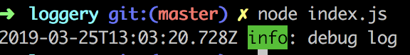
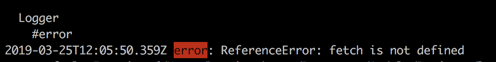

# Loggery
Custom messages logger for Node.js applications

[](https://circleci.com/gh/Harrisonkamau/loggery/tree/master)

#### Installation
`yarn add loggery`

#### Log levels
This package supports all of the logging levels built for [winston](https://github.com/winstonjs/winston/blob/master/README.md#logging-levels)

#### Logging
The default [Transport](https://github.com/winstonjs/winston/blob/master/README.md#transports) is `Console`. More transports will be added soon.

```javascript
const { logger } = require('loggery');

// log your errors
logger().error('error');

// log your debug info
logger().debug('debug info');

logger().info('debug info');

```

#### Color coded levels
Loggery color codes the log levels accordingly.
For errors, the level will be `red` in color.





#### Running tests
All of the Loggery tests are written in `mocha`.
Coverages to be added soon.

`yarn tests`
